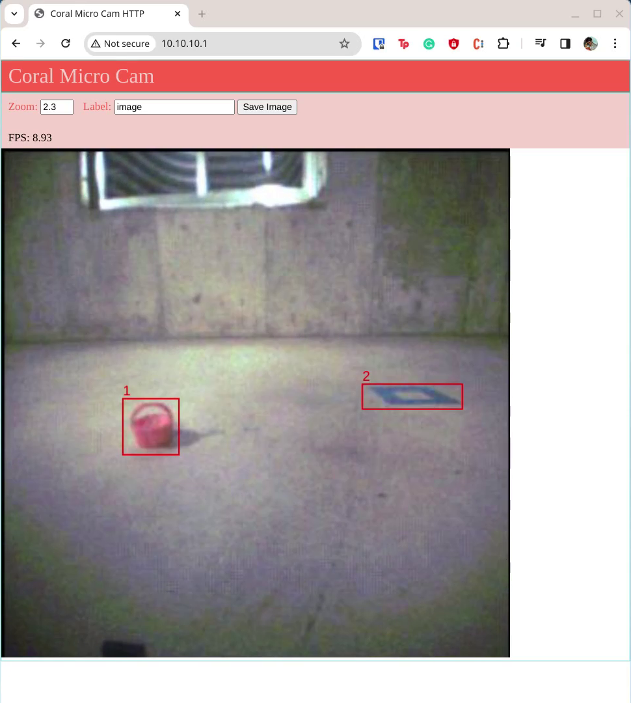

# Google Coral Dev Board Micro Example: Object Detection

This repository contains example code for gathering image data from the Coral Micro board, training an object detection model (MobileNetV2-SSD), compiling the model for the Google TPU, and deploying the model back to the Coral Micro.

Bounding box data is streamed over the USB and UART ports in JSON format. This allows you to parse the data on another platform to, for example, [control a robot](https://github.com/ShawnHymel/xrp-object-detection).

> **IMPORTANT!** The firmware examples found in this repository for the Google Coral Micro will compile only under Linux. This was tested with Ubuntu 20.04.

## Getting Started

Follow the readme in [firmware/image-collection-http](https://github.com/ShawnHymel/google-coral-micro-object-detection/tree/master/firmware/image-collection-http) to load the image collection firmware onto the Coral Micro. Collect images of your objects in their natural environment. I recommend at least 200 images of each object.

Use a tool like [labelImg](https://github.com/HumanSignal/labelImg) or [makesense.ai](https://www.makesense.ai/) to label your images. Save the bounding box information in *Pascal VOC* format. Save your images and annotations in the following format, archived in a file named *dataset.zip*:

```
dataset.zip
├── Annotations/
│   ├── image.01.xml
│   ├── image.02.xml
│   ├── ...
└── images/
    ├── image.01.jpg
    ├── image.02.jpg
    └── ...
```

Open the [MediaPipe Object Detection Learning notebook](https://github.com/ShawnHymel/google-coral-micro-object-detection/blob/master/notebooks/mediapipe-object-detection-learning.ipynb) and upload your *dataset.zip* to the filesystem. Run through the cells to train and export your object detection model. Your model and metadata files will be downloaded in a file named *exported_models.zip*.

You can test your model by uploading the *model.tflite* (or *model_int8.tflite*), *metadata.json*, and one of your image files to the [TFLite runtime test notebook](https://github.com/ShawnHymel/google-coral-micro-object-detection/blob/master/notebooks/tflite-runtime-test-object-detection.ipynb). Rename `IMAGE_PATH` to your uploaded image. Run through the cells to ensure that object detection works correctly.

Replace the files *model_int8_edgetpu.tflite* and *metadata.hpp* found in [firmware/object-detection-http](https://github.com/ShawnHymel/google-coral-micro-object-detection/tree/master/firmware/object-detection-http) with the files you downloaded in *exported_models.zip*. Follow the steps in the [object detection readme](https://github.com/ShawnHymel/google-coral-micro-object-detection/blob/master/firmware/object-detection-http/README.md) to compile and flash the inferencing firmware to your Coral Micro.

Once the Coral Micro starts running your code, open a browser and navigate to [http://10.10.10.1](http://10.10.10.1/) to see the camera input with a bounding box overlay. Note that this seems to only work in Linux (due to lack of Windows drivers for Ethernet-over-USB). It has not been tested on macOS.



## License

Unless otherwise specified, all code is licensed under the following license:

```
Licensed under the Apache License, Version 2.0 (the "License");
you may not use this file except in compliance with the License.
You may obtain a copy of the License at

    http://www.apache.org/licenses/LICENSE-2.0

Unless required by applicable law or agreed to in writing, software
distributed under the License is distributed on an "AS IS" BASIS,
WITHOUT WARRANTIES OR CONDITIONS OF ANY KIND, either express or implied.
See the License for the specific language governing permissions and
limitations under the License.
```